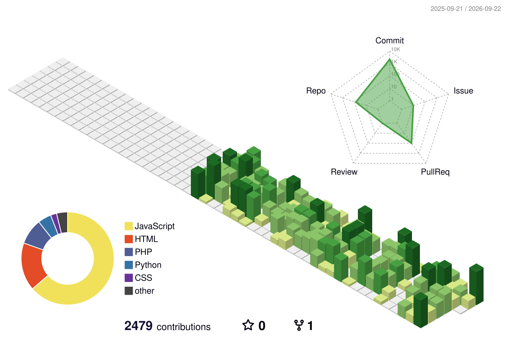

  
   
  

  <b>🌐 Dai un'occhiata ai miei progetti nel portfolio ↓</b>

  

<h3 align="center">Sviluppatore Web Full-Stack in formazione presso Boolean</h3>

  Sto costruendo le mie basi tecniche affrontando sfide quotidiane tra frontend e backend. Il mio approccio al lavoro è guidato dall'ordine e dalla precisione: amo costruire architetture pulite e mi dedico con tenacia a ogni riga di codice finché, dopo ogni sfida, non raggiungo la stabilità e la fluidità del software funzionante, trasformando le lezioni teoriche in applicazioni web concrete. Attualmente sto approfondendo <strong>PHP</strong> e <strong>Laravel</strong> per ampliare le mie competenze backend.

---

## 🛠 Il mio Tech Stack

  

---

## 🐍 GitHub Contributions Snake

  <picture>
    <source media="(prefers-color-scheme: dark)" srcset="https://raw.githubusercontent.com/francesco-cassese/francesco-cassese/output/github-contribution-grid-snake-dark.svg">
    <source media="(prefers-color-scheme: light)" srcset="https://raw.githubusercontent.com/francesco-cassese/francesco-cassese/output/github-contribution-grid-snake.svg">
    
  </picture>

---

## 🚀 Progetti in evidenza

### 🐷 Pork-edotto (E-commerce Full-Stack)
> Piattaforma E-commerce Full-Stack sviluppata in team con architettura multi-agente AI.

<b>🔍 Scopri di più sul mio contributo</b>

 

- 🧠 Progettazione e sviluppo dell'architettura **multi-agente AI** (usando LangChain e il modello Claude).
- 🛡️ Implementazione della validazione dei dati tramite **Zod** per garantire l'integrità dei dati scambiati tra AI e DB.
- 🔌 Collaborazione nel team per la creazione delle **API REST** e la gestione della pipeline dei dati tra il backend e l'intelligenza artificiale.

**Tecnologie**: Node.js, Express, MySQL, LangChain, Claude, Zod  
**Architettura**: [🔗 Frontend Repo](https://github.com/francesco-cassese/webapp-react) | [🔗 Backend Repo](https://github.com/francesco-cassese/webapp-express)

 

### 🌊 reSea (E-commerce Full-Stack)
> Piattaforma E-commerce Full-Stack con notifiche dinamiche via email.

<b>🔍 Scopri di più sul mio contributo</b>

 

- 🎨 **Frontend**: Sviluppo dell'interfaccia utente (UI) e gestione del flusso critico di **checkout** tramite React.
- ⚙️ **Backend**: Implementazione della logica di notifica dinamica (email transazionali) integrando **Nodemailer** e **Handlebars** per la creazione di template dinamici.

**Tecnologie**: React, Node.js, Express, Nodemailer, Handlebars  
**Architettura**: [🔗 Frontend Repo](https://github.com/francesco-cassese/reSea-Frontend) | [🔗 Backend Repo](https://github.com/francesco-cassese/reSea-Express)

---

## ⚡ Cosa mi appassiona e verso dove sto andando

 

<table>
  <tr>
    <td align="center" width="50%" valign="top">
      <h3>🛠 Backend Focused</h3>
      
Il mio interesse principale si concentra sulla logica server-side, la progettazione di API REST solide e l'ottimizzazione del mondo dei dati (<strong>MySQL</strong>). Sto ampliando queste competenze specializzandomi in <strong>PHP</strong> e nel framework <strong>Laravel</strong>.

    </td>
    <td align="center" width="50%" valign="top">
      <h3>🤖 Esploratore dell'AI</h3>
      
Sono profondamente affascinato dalle potenzialità degli <strong>LLM</strong>. Non mi limito a usarli: sto esplorando come integrarli nell'architettura backend per creare sistemi intelligenti e automatizzati (come ho fatto con LangChain in <i>Pork-edotto</i>).

    </td>
  </tr>
  <tr>
    <td align="center" width="50%" valign="top">
      <h3>🌱 In continua evoluzione</h3>
      
Non mi considero un prodotto finito, ma un "cantiere aperto". Ogni giorno è un'occasione per imparare nuovi pattern, migliorare la sicurezza del mio codice o trovare modi più efficienti per gestire i flussi di dati.

    </td>
    <td align="center" width="50%" valign="top">
      <h3>🏍 Traiettorie e Codice</h3>
      
Quando non sono davanti al PC a ottimizzare query o testare nuove architetture, mi trovi in sella alla mia moto. La guida mi insegna la stessa concentrazione e attenzione al dettaglio che applico ogni giorno nello sviluppo software.

    </td>
  </tr>
</table>

---

## 📊 Contribution Skyline

  

---

## 📫 Contattami

  
  
  

  
    
  <i>Ultimo aggiornamento: 2026-08-03</i>

